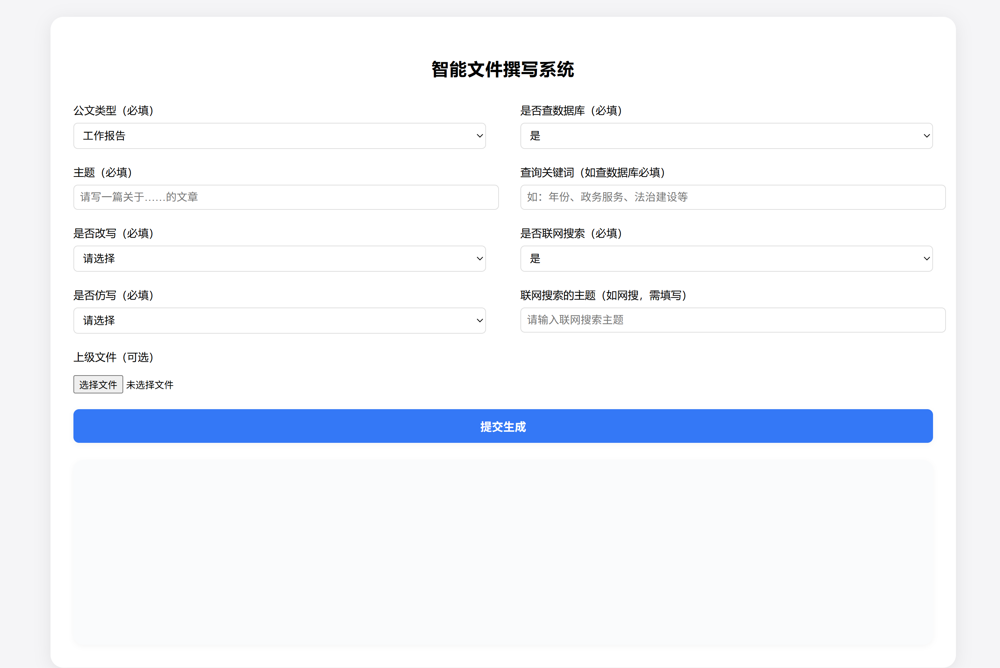
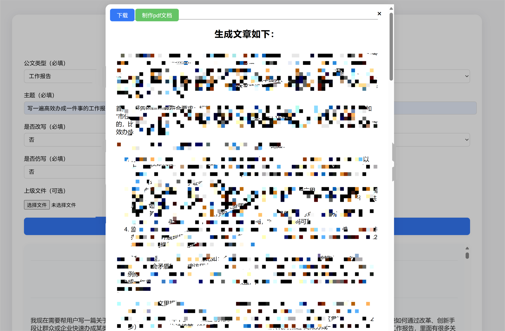
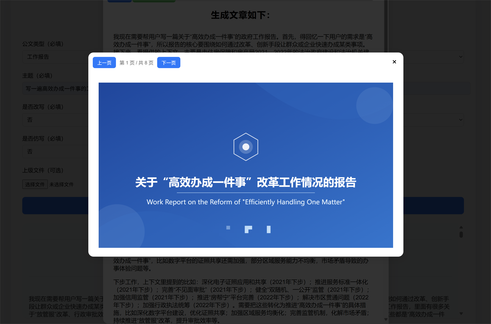

# 智能文件撰写系统

## 项目简介

智能文件撰写系统是一个基于 Flask 和 Dify API 的多功能公文/文章自动生成与辅助写作平台。系统支持改写、仿写、数据库查询、联网搜索等多种写作场景，适用于政务、企事业单位等需要高效文档处理的用户。

**新增功能：支持一键将生成的报告转为 PPT，PPT 由 Dify 工作流生成并以 SVG 形式可视化展示，生动形象。**

## 主要特性

- 支持多种公文类型（如工作报告、领导讲话、工作要点、处室总结、表态发言等）
- 支持原文改写、仿写（可上传多种格式文件）
- 可选数据库关键词查询与联网主题搜索
- 前端页面简洁，交互友好，支持多文件上传
- 后端对接 Dify API，流式返回 AI 生成内容
- 支持txt、docx、pdf等多种文件格式
- **支持报告一键转为 PPT，PPT 由 Dify 工作流生成，SVG 渲染，生动形象**
- **后端 app.py 中集成了两个 API，分别调用两个 Dify 工作流：一个用于生成报告，一个用于生成 PPT，互不影响，独立配置。**







## 技术栈

- 后端：Python 3.x, Flask, requests
- 前端：HTML5, 原生 JavaScript, CSS
- 依赖：Dify API（需本地或远程部署 Dify 服务）
- **PPT 生成：Dify 工作流（阻塞模式），SVG 渲染（前端多页切换预览）**

## 安装与部署

1. **环境准备**
   - Python 3.7 及以上
   - pip

2. **创建虚拟环境（推荐）**
   ```bash
   python -m venv .venv
   # Windows
   .venv\Scripts\activate
   # Linux/macOS
   source .venv/bin/activate
   ```

3. **安装依赖（使用清华源）**
   ```bash
   pip install -i https://pypi.tuna.tsinghua.edu.cn/simple -r requirements.txt
   ```

4. **配置 Dify API（两个工作流 Token）**
   - 默认 Dify API 地址为 `http://localhost/v1`
   - 默认报告生成 Token 为 `app-×××××`
   - 默认 PPT 生成 Token 为 `app-×××××`（需在 app.py 中配置，或通过环境变量设置）
   - 推荐通过环境变量设置 Token：
     ```bash
     set DIFY_API_TOKEN=your_report_token_here  # Windows，报告生成
     set PPT_API_TOKEN=your_ppt_token_here # Windows，PPT生成
     export DIFY_API_TOKEN=your_report_token_here  # Linux/macOS，报告生成
     export PPT_API_TOKEN=your_ppt_token_here # Linux/macOS，PPT生成
     ```
   - **app.py 中的 `/stream_chat` API 用于报告生成，`/generate_pdf`（或 `/generate_ppt`）API 用于 PPT 生成，分别调用不同的 Dify 工作流。**

5. **启动服务**
   ```bash
   python app.py
   ```
   默认监听 http://127.0.0.1:5055

## 使用说明

1. 访问首页（如 http://127.0.0.1:5000），填写表单，按需上传文件。
2. 选择公文类型、主题、是否改写/仿写/查数据库/联网搜索等选项。
3. 支持多种写作模式与辅助选项，上传相关文件（如原文、仿写文章、上级文件等）。
4. 点击“提交生成”，系统将实时流式返回 AI 生成内容。
5. **结果区支持美观的 Markdown 渲染**，标题、列表、加粗等格式与 Dify 后台一致。
6. **结果区为固定高度（250px），支持滚动浏览**，点击结果区可弹出模态窗口显示完整内容。
7. **弹窗内可一键“下载”生成的内容为 docx 文件**，下载前会自动去除所有 <think>…</think> 标签及其内容，导出文件名自动带有时间戳（如“公文输出_2024-06-09_221530.docx”）。
8. **弹窗内可一键“制作PPT”**，系统将调用 Dify 工作流生成 PPT 内容，并以 SVG 形式分页面展示，支持多页切换、高清预览。

## 目录结构

```
Dify-artilcle-writing-sys/
  ├── app.py                # 后端主程序（含报告与PPT两个API）
  ├── requirements.txt      # 依赖列表
  ├── templates/
  │     └── index.html      # 前端页面（含markdown渲染、弹窗、docx导出、PPT预览等功能）
  └── static/
        ├── favicon.ico     # 静态资源
        ├── marked.min.js   # Markdown渲染库
        └── html-docx.js    # HTML转docx导出库
```

## 配置说明

- Dify API 地址与 Token 支持环境变量配置。
- 默认 Token 仅供演示，生产环境请更换为安全的 Token。
- 如需对接数据库或外部 API，请参考 app.py 相关代码进行扩展。
- **PPT 生成需配置 Dify 工作流 Token，详见 app.py 中相关接口说明。报告与PPT生成分别支持独立 Token 配置。**
- **app.py 中 `/stream_chat` 和 `/generate_ppt`分别对应两个 Dify 工作流 API。**

## 常见问题

- **文件上传失败**：请检查 Dify API 服务是否正常运行，Token 是否正确。
- **AI 接口异常**：请检查网络连接、Dify API 配置及日志输出。
- **依赖安装失败**：请确保 Python 版本和 pip 工具可用。
- **端口冲突**：如 5000 端口被占用，可在 app.py 中修改端口。
- **PPT 生成失败**：请检查 PPT 相关 Dify 工作流 Token 是否配置正确，Dify 服务是否支持 PPT 生成。
- **SVG 无法预览**：请检查浏览器兼容性或 PPT 生成内容格式。
- **报告与PPT生成 Token 混用或未配置**：请分别检查两个 Token 的配置和权限。

## 贡献与许可

欢迎社区贡献代码、反馈问题或提出建议。请 fork 本仓库后提交 Pull Request。

本项目采用 MIT 许可证。

## 致谢

- 感谢 Dify 团队及相关开源项目的支持。
- 感谢所有贡献者和用户。
- **PPT 生成功能感谢 Dify 工作流及 SVG 渲染相关开源项目。** 